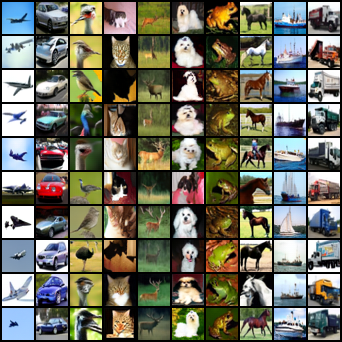
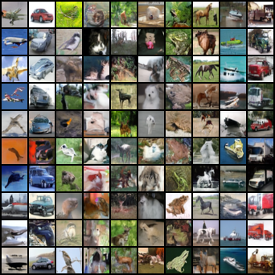
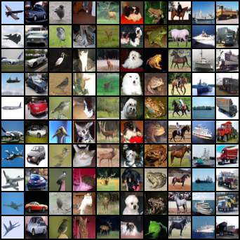

## Diffusion Transformer



This repo contains the Diffusion Transformer from the paper **Scalable Diffusion Models with Transformers (DiT)**. [[arxiv](https://arxiv.org/abs/2212.09748)] [[code](https://github.com/facebookresearch/DiT)]. It is a repo created with interest in the combination of diffusion model and transformer model. The code for the network is mostly based on the official implementation from MetaAI. I made several changes to the model with new techniques and tricks.

## Setup
You can recreate the conda environment using the provided environment.yml.
```
conda env create -f environment.yml
conda activate dit
```

## Sampling
You can sample from the model using the `Sampler` class in `sampler.py`.
```python
from sampler import Sampler
sampler = Sampler(model) # A trained DiT model
samples = sampler.sample(10) # Sample 10 images
# [10, C, H, W]
```
For visualization, I use `moviepy` to generate gifs from the intermediate steps of samples.


## Training
To train a DiT, you can use the `train.py` script.
```bash
python train.py
```
I use `wandb` for logging. If you don't want to use it, you can remove the logger in `train.py`.


## Techniques and Tricks
---
### Tailored SNR Samplers
I implement the Logit-Normal Sampling for the timesteps. The technique is used in the Research Paper of [Stable Diffusion 3](https://arxiv.org/pdf/2403.03206). This is useful for biasing the intermediate steps during the training of the diffusion model.
### ViT with registers
I add register tokens to the Transformer Model which is from the paper [Vision Transformers need registers](https://arxiv.org/pdf/2309.16588). The paper shows that adding additional register tokens can improve the performance of the model.
### Classifier-Free Guidance
For the DiT model, I implement another forward function for classifier-free guidance. This is useful for sampling from the model.
Samples with 1.0 and 2.5 cfg scale:





### EMA
I use the Exponential Moving Average (EMA) for the model weights. This helps to stabilize the training and improve the performance of the model.